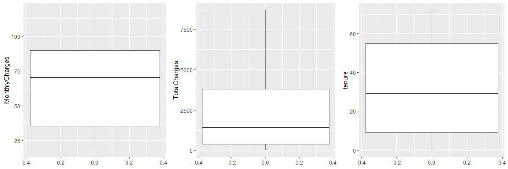
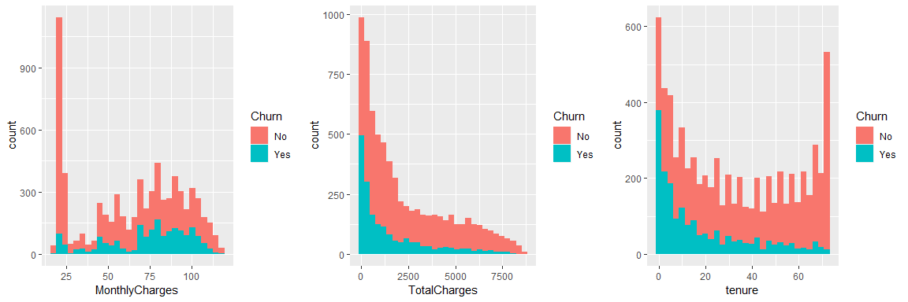
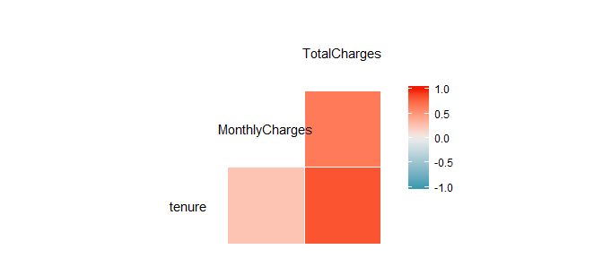
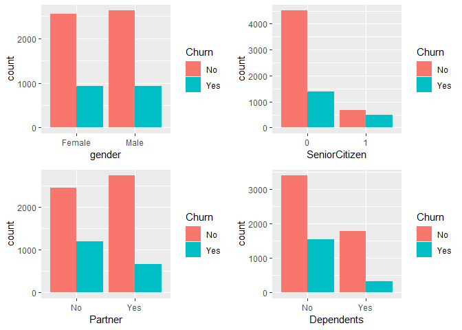
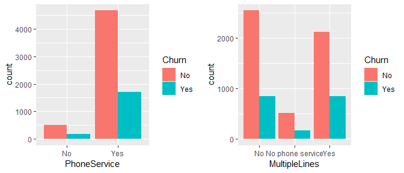
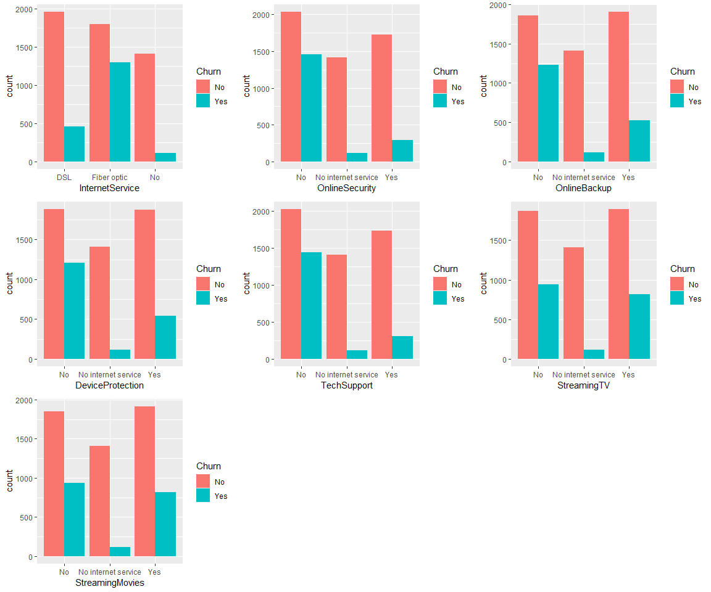
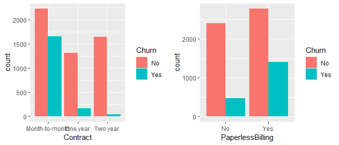
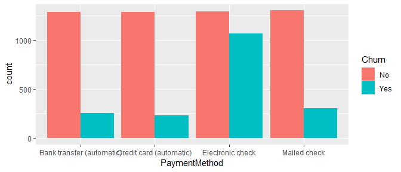
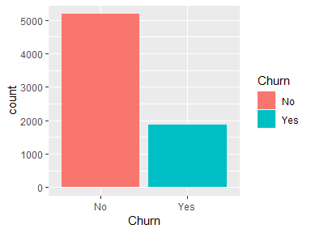

Telco Churn Analysis
================

``` r
library(ggplot2)
library(skimr)
```

    ## 
    ## Attaching package: 'skimr'

    ## The following object is masked from 'package:stats':
    ## 
    ##     filter

``` r
library(gridExtra)
library(GGally)
library(fastDummies)
library(dummies)
```

    ## dummies-1.5.6 provided by Decision Patterns

``` r
library(caret)
```

    ## Loading required package: lattice

## Importando dataset

``` r
telco <- read.table(file = "WA_Fn-UseC_-Telco-Customer-Churn.csv", header = T, sep = ",")
head(telco)
```

    ##   customerID gender SeniorCitizen Partner Dependents tenure PhoneService
    ## 1 7590-VHVEG Female             0     Yes         No      1           No
    ## 2 5575-GNVDE   Male             0      No         No     34          Yes
    ## 3 3668-QPYBK   Male             0      No         No      2          Yes
    ## 4 7795-CFOCW   Male             0      No         No     45           No
    ## 5 9237-HQITU Female             0      No         No      2          Yes
    ## 6 9305-CDSKC Female             0      No         No      8          Yes
    ##      MultipleLines InternetService OnlineSecurity OnlineBackup
    ## 1 No phone service             DSL             No          Yes
    ## 2               No             DSL            Yes           No
    ## 3               No             DSL            Yes          Yes
    ## 4 No phone service             DSL            Yes           No
    ## 5               No     Fiber optic             No           No
    ## 6              Yes     Fiber optic             No           No
    ##   DeviceProtection TechSupport StreamingTV StreamingMovies       Contract
    ## 1               No          No          No              No Month-to-month
    ## 2              Yes          No          No              No       One year
    ## 3               No          No          No              No Month-to-month
    ## 4              Yes         Yes          No              No       One year
    ## 5               No          No          No              No Month-to-month
    ## 6              Yes          No         Yes             Yes Month-to-month
    ##   PaperlessBilling             PaymentMethod MonthlyCharges TotalCharges
    ## 1              Yes          Electronic check          29.85        29.85
    ## 2               No              Mailed check          56.95      1889.50
    ## 3              Yes              Mailed check          53.85       108.15
    ## 4               No Bank transfer (automatic)          42.30      1840.75
    ## 5              Yes          Electronic check          70.70       151.65
    ## 6              Yes          Electronic check          99.65       820.50
    ##   Churn
    ## 1    No
    ## 2    No
    ## 3   Yes
    ## 4    No
    ## 5   Yes
    ## 6   Yes

``` r
str(telco)
```

    ## 'data.frame':    7043 obs. of  21 variables:
    ##  $ customerID      : Factor w/ 7043 levels "0002-ORFBO","0003-MKNFE",..: 5376 3963 2565 5536 6512 6552 1003 4771 5605 4535 ...
    ##  $ gender          : Factor w/ 2 levels "Female","Male": 1 2 2 2 1 1 2 1 1 2 ...
    ##  $ SeniorCitizen   : int  0 0 0 0 0 0 0 0 0 0 ...
    ##  $ Partner         : Factor w/ 2 levels "No","Yes": 2 1 1 1 1 1 1 1 2 1 ...
    ##  $ Dependents      : Factor w/ 2 levels "No","Yes": 1 1 1 1 1 1 2 1 1 2 ...
    ##  $ tenure          : int  1 34 2 45 2 8 22 10 28 62 ...
    ##  $ PhoneService    : Factor w/ 2 levels "No","Yes": 1 2 2 1 2 2 2 1 2 2 ...
    ##  $ MultipleLines   : Factor w/ 3 levels "No","No phone service",..: 2 1 1 2 1 3 3 2 3 1 ...
    ##  $ InternetService : Factor w/ 3 levels "DSL","Fiber optic",..: 1 1 1 1 2 2 2 1 2 1 ...
    ##  $ OnlineSecurity  : Factor w/ 3 levels "No","No internet service",..: 1 3 3 3 1 1 1 3 1 3 ...
    ##  $ OnlineBackup    : Factor w/ 3 levels "No","No internet service",..: 3 1 3 1 1 1 3 1 1 3 ...
    ##  $ DeviceProtection: Factor w/ 3 levels "No","No internet service",..: 1 3 1 3 1 3 1 1 3 1 ...
    ##  $ TechSupport     : Factor w/ 3 levels "No","No internet service",..: 1 1 1 3 1 1 1 1 3 1 ...
    ##  $ StreamingTV     : Factor w/ 3 levels "No","No internet service",..: 1 1 1 1 1 3 3 1 3 1 ...
    ##  $ StreamingMovies : Factor w/ 3 levels "No","No internet service",..: 1 1 1 1 1 3 1 1 3 1 ...
    ##  $ Contract        : Factor w/ 3 levels "Month-to-month",..: 1 2 1 2 1 1 1 1 1 2 ...
    ##  $ PaperlessBilling: Factor w/ 2 levels "No","Yes": 2 1 2 1 2 2 2 1 2 1 ...
    ##  $ PaymentMethod   : Factor w/ 4 levels "Bank transfer (automatic)",..: 3 4 4 1 3 3 2 4 3 1 ...
    ##  $ MonthlyCharges  : num  29.9 57 53.9 42.3 70.7 ...
    ##  $ TotalCharges    : num  29.9 1889.5 108.2 1840.8 151.7 ...
    ##  $ Churn           : Factor w/ 2 levels "No","Yes": 1 1 2 1 2 2 1 1 2 1 ...

## Ajustando categoria da variável SeniorCitizen

``` r
telco$SeniorCitizen <- as.factor(telco$SeniorCitizen)
telco$customerID <- NULL
```

## Visualizando informações do dataset

``` r
summary(telco)
```

    ##     gender     SeniorCitizen Partner    Dependents     tenure     
    ##  Female:3488   0:5901        No :3641   No :4933   Min.   : 0.00  
    ##  Male  :3555   1:1142        Yes:3402   Yes:2110   1st Qu.: 9.00  
    ##                                                    Median :29.00  
    ##                                                    Mean   :32.37  
    ##                                                    3rd Qu.:55.00  
    ##                                                    Max.   :72.00  
    ##                                                                   
    ##  PhoneService          MultipleLines     InternetService
    ##  No : 682     No              :3390   DSL        :2421  
    ##  Yes:6361     No phone service: 682   Fiber optic:3096  
    ##               Yes             :2971   No         :1526  
    ##                                                         
    ##                                                         
    ##                                                         
    ##                                                         
    ##              OnlineSecurity              OnlineBackup 
    ##  No                 :3498   No                 :3088  
    ##  No internet service:1526   No internet service:1526  
    ##  Yes                :2019   Yes                :2429  
    ##                                                       
    ##                                                       
    ##                                                       
    ##                                                       
    ##             DeviceProtection              TechSupport  
    ##  No                 :3095    No                 :3473  
    ##  No internet service:1526    No internet service:1526  
    ##  Yes                :2422    Yes                :2044  
    ##                                                        
    ##                                                        
    ##                                                        
    ##                                                        
    ##               StreamingTV              StreamingMovies
    ##  No                 :2810   No                 :2785  
    ##  No internet service:1526   No internet service:1526  
    ##  Yes                :2707   Yes                :2732  
    ##                                                       
    ##                                                       
    ##                                                       
    ##                                                       
    ##            Contract    PaperlessBilling                   PaymentMethod 
    ##  Month-to-month:3875   No :2872         Bank transfer (automatic):1544  
    ##  One year      :1473   Yes:4171         Credit card (automatic)  :1522  
    ##  Two year      :1695                    Electronic check         :2365  
    ##                                         Mailed check             :1612  
    ##                                                                         
    ##                                                                         
    ##                                                                         
    ##  MonthlyCharges    TotalCharges    Churn     
    ##  Min.   : 18.25   Min.   :  18.8   No :5174  
    ##  1st Qu.: 35.50   1st Qu.: 401.4   Yes:1869  
    ##  Median : 70.35   Median :1397.5             
    ##  Mean   : 64.76   Mean   :2283.3             
    ##  3rd Qu.: 89.85   3rd Qu.:3794.7             
    ##  Max.   :118.75   Max.   :8684.8             
    ##                   NA's   :11

``` r
skim(telco)
```

    ## Skim summary statistics
    ##  n obs: 7043 
    ##  n variables: 20 
    ## 
    ## -- Variable type:factor -----------------------------------------------------------------------------------------------
    ##          variable missing complete    n n_unique
    ##             Churn       0     7043 7043        2
    ##          Contract       0     7043 7043        3
    ##        Dependents       0     7043 7043        2
    ##  DeviceProtection       0     7043 7043        3
    ##            gender       0     7043 7043        2
    ##   InternetService       0     7043 7043        3
    ##     MultipleLines       0     7043 7043        3
    ##      OnlineBackup       0     7043 7043        3
    ##    OnlineSecurity       0     7043 7043        3
    ##  PaperlessBilling       0     7043 7043        2
    ##           Partner       0     7043 7043        2
    ##     PaymentMethod       0     7043 7043        4
    ##      PhoneService       0     7043 7043        2
    ##     SeniorCitizen       0     7043 7043        2
    ##   StreamingMovies       0     7043 7043        3
    ##       StreamingTV       0     7043 7043        3
    ##       TechSupport       0     7043 7043        3
    ##                                  top_counts ordered
    ##                  No: 5174, Yes: 1869, NA: 0   FALSE
    ##      Mon: 3875, Two: 1695, One: 1473, NA: 0   FALSE
    ##                  No: 4933, Yes: 2110, NA: 0   FALSE
    ##       No: 3095, Yes: 2422, No : 1526, NA: 0   FALSE
    ##                 Mal: 3555, Fem: 3488, NA: 0   FALSE
    ##       Fib: 3096, DSL: 2421, No: 1526, NA: 0   FALSE
    ##        No: 3390, Yes: 2971, No : 682, NA: 0   FALSE
    ##       No: 3088, Yes: 2429, No : 1526, NA: 0   FALSE
    ##       No: 3498, Yes: 2019, No : 1526, NA: 0   FALSE
    ##                  Yes: 4171, No: 2872, NA: 0   FALSE
    ##                  No: 3641, Yes: 3402, NA: 0   FALSE
    ##  Ele: 2365, Mai: 1612, Ban: 1544, Cre: 1522   FALSE
    ##                   Yes: 6361, No: 682, NA: 0   FALSE
    ##                     0: 5901, 1: 1142, NA: 0   FALSE
    ##       No: 2785, Yes: 2732, No : 1526, NA: 0   FALSE
    ##       No: 2810, Yes: 2707, No : 1526, NA: 0   FALSE
    ##       No: 3473, Yes: 2044, No : 1526, NA: 0   FALSE
    ## 
    ## -- Variable type:integer ----------------------------------------------------------------------------------------------
    ##  variable missing complete    n  mean    sd p0 p25 p50 p75 p100     hist
    ##    tenure       0     7043 7043 32.37 24.56  0   9  29  55   72 <U+2587><U+2583><U+2583><U+2582><U+2582><U+2583><U+2583><U+2585>
    ## 
    ## -- Variable type:numeric ----------------------------------------------------------------------------------------------
    ##        variable missing complete    n    mean      sd    p0    p25     p50
    ##  MonthlyCharges       0     7043 7043   64.76   30.09 18.25  35.5    70.35
    ##    TotalCharges      11     7032 7043 2283.3  2266.77 18.8  401.45 1397.47
    ##      p75    p100     hist
    ##    89.85  118.75 <U+2587><U+2581><U+2583><U+2582><U+2586><U+2585><U+2585><U+2582>
    ##  3794.74 8684.8  <U+2587><U+2583><U+2582><U+2582><U+2581><U+2581><U+2581><U+2581>

# Variáveis quantitativas

## Valores pagos e tempo de serviço

``` r
grid.arrange(ggplot(telco, aes(y = MonthlyCharges)) + 
               geom_boxplot(),
             ggplot(telco, aes(y = TotalCharges)) + 
               geom_boxplot(),
             ggplot(telco, aes(y = tenure)) + 
               geom_boxplot(), ncol=3)
```

    ## Warning: Removed 11 rows containing non-finite values (stat_boxplot).

<!-- -->

``` r
grid.arrange(ggplot(telco, aes(x = MonthlyCharges, fill = Churn)) + 
               geom_histogram(),
             ggplot(telco, aes(x = TotalCharges, fill = Churn)) + 
               geom_histogram(),
             ggplot(telco, aes(x = tenure, fill = Churn)) + 
               geom_histogram(), ncol=3)
```

    ## `stat_bin()` using `bins = 30`. Pick better value with `binwidth`.
    ## `stat_bin()` using `bins = 30`. Pick better value with `binwidth`.

    ## Warning: Removed 11 rows containing non-finite values (stat_bin).

    ## `stat_bin()` using `bins = 30`. Pick better value with `binwidth`.

<!-- -->

## Correlação

``` r
ggcorr(telco)
```

    ## Warning in ggcorr(telco): data in column(s) 'gender', 'SeniorCitizen',
    ## 'Partner', 'Dependents', 'PhoneService', 'MultipleLines',
    ## 'InternetService', 'OnlineSecurity', 'OnlineBackup', 'DeviceProtection',
    ## 'TechSupport', 'StreamingTV', 'StreamingMovies', 'Contract',
    ## 'PaperlessBilling', 'PaymentMethod', 'Churn' are not numeric and were
    ## ignored

<!-- -->

# Variáveis qualitativas

## Informações sobre o clinte

``` r
grid.arrange(ggplot(telco, aes(x=gender, fill=Churn))+ geom_bar(position = "dodge"),
             ggplot(telco, aes(x=SeniorCitizen, fill=Churn))+ geom_bar(position = "dodge"),
             ggplot(telco, aes(x=Partner, fill=Churn))+ geom_bar(position = "dodge"),
             ggplot(telco, aes(x=Dependents, fill=Churn))+ geom_bar(position = "dodge"), ncol=2)
```

<!-- -->

## Serviços de telefone

``` r
grid.arrange(ggplot(telco, aes(x=PhoneService, fill=Churn))+ geom_bar(position = "dodge"),
             ggplot(telco, aes(x=MultipleLines, fill=Churn))+ geom_bar(position = "dodge"), ncol=2)
```

<!-- -->

## Serviços de internet

``` r
grid.arrange(ggplot(telco, aes(x=InternetService, fill=Churn))+ geom_bar(position = "dodge"),
             ggplot(telco, aes(x=OnlineSecurity, fill=Churn))+ geom_bar(position = "dodge"),
             ggplot(telco, aes(x=OnlineBackup, fill=Churn))+ geom_bar(position = "dodge"),
             ggplot(telco, aes(x=DeviceProtection, fill=Churn))+ geom_bar(position = "dodge"),
             ggplot(telco, aes(x=TechSupport, fill=Churn))+ geom_bar(position = "dodge"),
             ggplot(telco, aes(x=StreamingTV, fill=Churn))+ geom_bar(position = "dodge"),
             ggplot(telco, aes(x=StreamingMovies, fill=Churn))+ geom_bar(position = "dodge"), ncol=3)
```

<!-- -->

## Pagamento e contrato

``` r
grid.arrange(ggplot(telco, aes(x=Contract, fill=Churn))+ geom_bar(position = "dodge"),
             ggplot(telco, aes(x=PaperlessBilling, fill=Churn))+ geom_bar(position = "dodge"), ncol=2)
```

<!-- -->

``` r
ggplot(telco, aes(x=PaymentMethod, fill=Churn))+ geom_bar(position = "dodge")
```

<!-- -->

## Churn

``` r
ggplot(telco, aes(x=Churn, fill=Churn))+ geom_bar(position = "dodge")
```

<!-- -->

# Criando Modelo

## Balanceando base

``` r
options(scipen=999)
set.seed(123)

table(telco$Churn)
```

    ## 
    ##   No  Yes 
    ## 5174 1869

``` r
Base1 <- subset(telco, telco$Churn=="Yes")
Base0 <- subset(telco, telco$Churn=="No")
dt = sort(sample(nrow(Base0), 1869))
Amostra_0 <- Base0[dt,]
base_balanceada = rbind(Base1, Amostra_0)
table(base_balanceada$Churn)
```

    ## 
    ##   No  Yes 
    ## 1869 1869

## Modelo glm

``` r
modelo <- glm(Churn ~
                .,
              family=binomial(link='logit'),data=base_balanceada)
summary(modelo)
```

    ## 
    ## Call:
    ## glm(formula = Churn ~ ., family = binomial(link = "logit"), data = base_balanceada)
    ## 
    ## Deviance Residuals: 
    ##     Min       1Q   Median       3Q      Max  
    ## -2.2101  -0.7636   0.3427   0.7411   3.0489  
    ## 
    ## Coefficients: (7 not defined because of singularities)
    ##                                         Estimate  Std. Error z value
    ## (Intercept)                           2.50131867  1.04464187   2.394
    ## genderMale                            0.11454846  0.08245622   1.389
    ## SeniorCitizen1                        0.23158795  0.11077496   2.091
    ## PartnerYes                           -0.04159590  0.09881773  -0.421
    ## DependentsYes                        -0.18912185  0.11020337  -1.716
    ## tenure                               -0.05948910  0.00702267  -8.471
    ## PhoneServiceYes                       0.39083524  0.82220760   0.475
    ## MultipleLinesNo phone service                 NA          NA      NA
    ## MultipleLinesYes                      0.51515293  0.22681951   2.271
    ## InternetServiceFiber optic            2.07579125  1.01502331   2.045
    ## InternetServiceNo                    -2.09098842  1.02316789  -2.044
    ## OnlineSecurityNo internet service             NA          NA      NA
    ## OnlineSecurityYes                     0.00035023  0.22848253   0.002
    ## OnlineBackupNo internet service               NA          NA      NA
    ## OnlineBackupYes                       0.20828238  0.22494058   0.926
    ## DeviceProtectionNo internet service           NA          NA      NA
    ## DeviceProtectionYes                   0.18455026  0.22301056   0.828
    ## TechSupportNo internet service                NA          NA      NA
    ## TechSupportYes                       -0.03581015  0.22744358  -0.157
    ## StreamingTVNo internet service                NA          NA      NA
    ## StreamingTVYes                        0.75795733  0.41703780   1.817
    ## StreamingMoviesNo internet service            NA          NA      NA
    ## StreamingMoviesYes                    0.84097827  0.41468519   2.028
    ## ContractOne year                     -0.67426029  0.12744179  -5.291
    ## ContractTwo year                     -1.33254844  0.19416778  -6.863
    ## PaperlessBillingYes                   0.36379794  0.09260343   3.929
    ## PaymentMethodCredit card (automatic) -0.02575349  0.13804102  -0.187
    ## PaymentMethodElectronic check         0.30934132  0.11698507   2.644
    ## PaymentMethodMailed check             0.03454742  0.14222931   0.243
    ## MonthlyCharges                       -0.05572720  0.04037375  -1.380
    ## TotalCharges                          0.00030205  0.00008115   3.722
    ##                                                  Pr(>|z|)    
    ## (Intercept)                                      0.016646 *  
    ## genderMale                                       0.164771    
    ## SeniorCitizen1                                   0.036562 *  
    ## PartnerYes                                       0.673802    
    ## DependentsYes                                    0.086141 .  
    ## tenure                               < 0.0000000000000002 ***
    ## PhoneServiceYes                                  0.634539    
    ## MultipleLinesNo phone service                          NA    
    ## MultipleLinesYes                                 0.023135 *  
    ## InternetServiceFiber optic                       0.040848 *  
    ## InternetServiceNo                                0.040989 *  
    ## OnlineSecurityNo internet service                      NA    
    ## OnlineSecurityYes                                0.998777    
    ## OnlineBackupNo internet service                        NA    
    ## OnlineBackupYes                                  0.354475    
    ## DeviceProtectionNo internet service                    NA    
    ## DeviceProtectionYes                              0.407931    
    ## TechSupportNo internet service                         NA    
    ## TechSupportYes                                   0.874893    
    ## StreamingTVNo internet service                         NA    
    ## StreamingTVYes                                   0.069144 .  
    ## StreamingMoviesNo internet service                     NA    
    ## StreamingMoviesYes                               0.042561 *  
    ## ContractOne year                         0.00000012182797 ***
    ## ContractTwo year                         0.00000000000675 ***
    ## PaperlessBillingYes                      0.00008545673426 ***
    ## PaymentMethodCredit card (automatic)             0.852002    
    ## PaymentMethodElectronic check                    0.008186 ** 
    ## PaymentMethodMailed check                        0.808083    
    ## MonthlyCharges                                   0.167500    
    ## TotalCharges                                     0.000198 ***
    ## ---
    ## Signif. codes:  0 '***' 0.001 '**' 0.01 '*' 0.05 '.' 0.1 ' ' 1
    ## 
    ## (Dispersion parameter for binomial family taken to be 1)
    ## 
    ##     Null deviance: 5173.6  on 3731  degrees of freedom
    ## Residual deviance: 3604.8  on 3708  degrees of freedom
    ##   (6 observations deleted due to missingness)
    ## AIC: 3652.8
    ## 
    ## Number of Fisher Scoring iterations: 5

``` r
pred = predict(modelo,telco, type = "response")
```

    ## Warning in predict.lm(object, newdata, se.fit, scale = 1, type =
    ## ifelse(type == : prediction from a rank-deficient fit may be misleading

## Criando uma nova base com a base original+valores preditos

``` r
base_final = cbind(telco, pred)
head(base_final)
```

    ##   gender SeniorCitizen Partner Dependents tenure PhoneService
    ## 1 Female             0     Yes         No      1           No
    ## 2   Male             0      No         No     34          Yes
    ## 3   Male             0      No         No      2          Yes
    ## 4   Male             0      No         No     45           No
    ## 5 Female             0      No         No      2          Yes
    ## 6 Female             0      No         No      8          Yes
    ##      MultipleLines InternetService OnlineSecurity OnlineBackup
    ## 1 No phone service             DSL             No          Yes
    ## 2               No             DSL            Yes           No
    ## 3               No             DSL            Yes          Yes
    ## 4 No phone service             DSL            Yes           No
    ## 5               No     Fiber optic             No           No
    ## 6              Yes     Fiber optic             No           No
    ##   DeviceProtection TechSupport StreamingTV StreamingMovies       Contract
    ## 1               No          No          No              No Month-to-month
    ## 2              Yes          No          No              No       One year
    ## 3               No          No          No              No Month-to-month
    ## 4              Yes         Yes          No              No       One year
    ## 5               No          No          No              No Month-to-month
    ## 6              Yes          No         Yes             Yes Month-to-month
    ##   PaperlessBilling             PaymentMethod MonthlyCharges TotalCharges
    ## 1              Yes          Electronic check          29.85        29.85
    ## 2               No              Mailed check          56.95      1889.50
    ## 3              Yes              Mailed check          53.85       108.15
    ## 4               No Bank transfer (automatic)          42.30      1840.75
    ## 5              Yes          Electronic check          70.70       151.65
    ## 6              Yes          Electronic check          99.65       820.50
    ##   Churn       pred
    ## 1    No 0.83578769
    ## 2    No 0.11168129
    ## 3   Yes 0.62865681
    ## 4    No 0.08412503
    ## 5   Yes 0.83589529
    ## 6   Yes 0.89645354

## Criando a resposta final usando o ponto de corte

``` r
base_final$resposta <- as.factor(ifelse(base_final$pred>0.7, "Yes", "No"))
head(base_final)
```

    ##   gender SeniorCitizen Partner Dependents tenure PhoneService
    ## 1 Female             0     Yes         No      1           No
    ## 2   Male             0      No         No     34          Yes
    ## 3   Male             0      No         No      2          Yes
    ## 4   Male             0      No         No     45           No
    ## 5 Female             0      No         No      2          Yes
    ## 6 Female             0      No         No      8          Yes
    ##      MultipleLines InternetService OnlineSecurity OnlineBackup
    ## 1 No phone service             DSL             No          Yes
    ## 2               No             DSL            Yes           No
    ## 3               No             DSL            Yes          Yes
    ## 4 No phone service             DSL            Yes           No
    ## 5               No     Fiber optic             No           No
    ## 6              Yes     Fiber optic             No           No
    ##   DeviceProtection TechSupport StreamingTV StreamingMovies       Contract
    ## 1               No          No          No              No Month-to-month
    ## 2              Yes          No          No              No       One year
    ## 3               No          No          No              No Month-to-month
    ## 4              Yes         Yes          No              No       One year
    ## 5               No          No          No              No Month-to-month
    ## 6              Yes          No         Yes             Yes Month-to-month
    ##   PaperlessBilling             PaymentMethod MonthlyCharges TotalCharges
    ## 1              Yes          Electronic check          29.85        29.85
    ## 2               No              Mailed check          56.95      1889.50
    ## 3              Yes              Mailed check          53.85       108.15
    ## 4               No Bank transfer (automatic)          42.30      1840.75
    ## 5              Yes          Electronic check          70.70       151.65
    ## 6              Yes          Electronic check          99.65       820.50
    ##   Churn       pred resposta
    ## 1    No 0.83578769      Yes
    ## 2    No 0.11168129       No
    ## 3   Yes 0.62865681       No
    ## 4    No 0.08412503       No
    ## 5   Yes 0.83589529      Yes
    ## 6   Yes 0.89645354      Yes

## Tabela de classificação

``` r
table(base_final$Churn,base_final$resposta)
```

    ##      
    ##         No  Yes
    ##   No  4514  649
    ##   Yes  751 1118

# Removendo variáveis utilizando 90% de confiança utilizando metódo de seleção Backward

Chegamos ao resultado na décima quinta iteração

``` r
base_balanceada2 <- dummy_cols(base_balanceada, 
                               select_columns = c("MultipleLines", "InternetService", "OnlineSecurity", "OnlineBackup", "DeviceProtection",
                                                         "TechSupport", "StreamingTV", "StreamingMovies ", "Contract", "PaymentMethod"),
                                                          remove_first_dummy = TRUE)
```

``` 
## Warning in dummy_cols(base_balanceada, select_columns = c("MultipleLines", : NOTE: The following select_columns input(s) is not a column in data.
##  
```

``` r
base_balanceada2 <- base_balanceada2[, -c(7,8,9,10,11,12,13,14,15,17)]
names(base_balanceada2) <- gsub(" ", "", names(base_balanceada2))
names(base_balanceada2) <- gsub("\\(", "", names(base_balanceada2))
names(base_balanceada2) <- gsub(")", "", names(base_balanceada2))
str(base_balanceada2)
```

    ## 'data.frame':    3738 obs. of  29 variables:
    ##  $ gender                            : Factor w/ 2 levels "Female","Male": 2 1 1 1 2 1 2 2 2 2 ...
    ##  $ SeniorCitizen                     : Factor w/ 2 levels "0","1": 1 1 1 1 1 1 2 1 1 1 ...
    ##  $ Partner                           : Factor w/ 2 levels "No","Yes": 1 1 1 2 1 2 1 1 2 2 ...
    ##  $ Dependents                        : Factor w/ 2 levels "No","Yes": 1 1 1 1 1 2 1 1 2 2 ...
    ##  $ tenure                            : int  2 2 8 28 49 10 1 1 47 1 ...
    ##  $ PhoneService                      : Factor w/ 2 levels "No","Yes": 2 2 2 2 2 2 1 2 2 1 ...
    ##  $ PaperlessBilling                  : Factor w/ 2 levels "No","Yes": 2 2 2 2 2 1 2 1 2 1 ...
    ##  $ MonthlyCharges                    : num  53.9 70.7 99.7 104.8 103.7 ...
    ##  $ TotalCharges                      : num  108 152 820 3046 5036 ...
    ##  $ Churn                             : Factor w/ 2 levels "No","Yes": 2 2 2 2 2 2 2 2 2 2 ...
    ##  $ MultipleLines_Nophoneservice      : int  0 0 0 0 0 0 1 0 0 1 ...
    ##  $ MultipleLines_Yes                 : int  0 0 1 1 1 0 0 0 1 0 ...
    ##  $ InternetService_Fiberoptic        : int  0 1 1 1 1 0 0 0 1 0 ...
    ##  $ InternetService_No                : int  0 0 0 0 0 0 0 1 0 0 ...
    ##  $ OnlineSecurity_Nointernetservice  : int  0 0 0 0 0 0 0 1 0 0 ...
    ##  $ OnlineSecurity_Yes                : int  1 0 0 0 0 0 0 0 0 0 ...
    ##  $ OnlineBackup_Nointernetservice    : int  0 0 0 0 0 0 0 1 0 0 ...
    ##  $ OnlineBackup_Yes                  : int  1 0 0 0 1 0 0 0 1 1 ...
    ##  $ DeviceProtection_Nointernetservice: int  0 0 0 0 0 0 0 1 0 0 ...
    ##  $ DeviceProtection_Yes              : int  0 0 1 1 1 1 1 0 0 0 ...
    ##  $ TechSupport_Nointernetservice     : int  0 0 0 0 0 0 0 1 0 0 ...
    ##  $ TechSupport_Yes                   : int  0 0 0 1 0 1 0 0 0 0 ...
    ##  $ StreamingTV_Nointernetservice     : int  0 0 0 0 0 0 0 1 0 0 ...
    ##  $ StreamingTV_Yes                   : int  0 0 1 1 1 0 0 0 1 0 ...
    ##  $ Contract_Oneyear                  : int  0 0 0 0 0 0 0 0 0 0 ...
    ##  $ Contract_Twoyear                  : int  0 0 0 0 0 0 0 0 0 0 ...
    ##  $ PaymentMethod_Creditcardautomatic : int  0 0 0 0 0 1 0 0 0 0 ...
    ##  $ PaymentMethod_Electroniccheck     : int  0 1 1 1 0 0 1 0 1 1 ...
    ##  $ PaymentMethod_Mailedcheck         : int  1 0 0 0 0 0 0 1 0 0 ...

``` r
modelo15 <- glm(Churn ~
                  . - StreamingTV_Yes - PaymentMethod_Creditcardautomatic - TechSupport_Yes
                - PaymentMethod_Mailedcheck - Partner - InternetService_No - OnlineSecurity_Nointernetservice
                - OnlineBackup_Nointernetservice - DeviceProtection_Nointernetservice - TechSupport_Nointernetservice
                - StreamingTV_Nointernetservice - gender - MultipleLines_Yes - InternetService_Fiberoptic,
                family=binomial(link='logit'), data=base_balanceada2)
summary(modelo15)
```

    ## 
    ## Call:
    ## glm(formula = Churn ~ . - StreamingTV_Yes - PaymentMethod_Creditcardautomatic - 
    ##     TechSupport_Yes - PaymentMethod_Mailedcheck - Partner - InternetService_No - 
    ##     OnlineSecurity_Nointernetservice - OnlineBackup_Nointernetservice - 
    ##     DeviceProtection_Nointernetservice - TechSupport_Nointernetservice - 
    ##     StreamingTV_Nointernetservice - gender - MultipleLines_Yes - 
    ##     InternetService_Fiberoptic, family = binomial(link = "logit"), 
    ##     data = base_balanceada2)
    ## 
    ## Deviance Residuals: 
    ##     Min       1Q   Median       3Q      Max  
    ## -2.2230  -0.7840   0.3814   0.7567   3.1292  
    ## 
    ## Coefficients: (1 not defined because of singularities)
    ##                                  Estimate  Std. Error z value
    ## (Intercept)                    0.40377347  0.20110841   2.008
    ## SeniorCitizen1                 0.27037040  0.10885333   2.484
    ## DependentsYes                 -0.20267951  0.09908722  -2.045
    ## tenure                        -0.05837325  0.00677113  -8.621
    ## PhoneServiceYes               -1.13500231  0.16379645  -6.929
    ## PaperlessBillingYes            0.38857680  0.09181289   4.232
    ## MonthlyCharges                 0.02512556  0.00266108   9.442
    ## TotalCharges                   0.00029542  0.00007754   3.810
    ## MultipleLines_Nophoneservice           NA          NA      NA
    ## OnlineSecurity_Yes            -0.46442973  0.10285504  -4.515
    ## OnlineBackup_Yes              -0.20904142  0.09956209  -2.100
    ## DeviceProtection_Yes          -0.24023836  0.10154207  -2.366
    ## Contract_Oneyear              -0.78048033  0.12380908  -6.304
    ## Contract_Twoyear              -1.52432675  0.18937180  -8.049
    ## PaymentMethod_Electroniccheck  0.34706776  0.08790222   3.948
    ##                                           Pr(>|z|)    
    ## (Intercept)                               0.044671 *  
    ## SeniorCitizen1                            0.012999 *  
    ## DependentsYes                             0.040809 *  
    ## tenure                        < 0.0000000000000002 ***
    ## PhoneServiceYes               0.000000000004227897 ***
    ## PaperlessBillingYes           0.000023134595895039 ***
    ## MonthlyCharges                < 0.0000000000000002 ***
    ## TotalCharges                              0.000139 ***
    ## MultipleLines_Nophoneservice                    NA    
    ## OnlineSecurity_Yes            0.000006320287730187 ***
    ## OnlineBackup_Yes                          0.035763 *  
    ## DeviceProtection_Yes                      0.017986 *  
    ## Contract_Oneyear              0.000000000290243232 ***
    ## Contract_Twoyear              0.000000000000000832 ***
    ## PaymentMethod_Electroniccheck 0.000078695340644495 ***
    ## ---
    ## Signif. codes:  0 '***' 0.001 '**' 0.01 '*' 0.05 '.' 0.1 ' ' 1
    ## 
    ## (Dispersion parameter for binomial family taken to be 1)
    ## 
    ##     Null deviance: 5173.6  on 3731  degrees of freedom
    ## Residual deviance: 3630.8  on 3718  degrees of freedom
    ##   (6 observations deleted due to missingness)
    ## AIC: 3658.8
    ## 
    ## Number of Fisher Scoring iterations: 5

# Testando Modelo

``` r
telco2 <- dummy_cols(telco, 
                     select_columns = c("MultipleLines", "InternetService", "OnlineSecurity", "OnlineBackup", "DeviceProtection",
                     "TechSupport", "StreamingTV", "StreamingMovies ", "Contract", "PaymentMethod"),
                     remove_first_dummy = TRUE)
```

``` 
## Warning in dummy_cols(telco, select_columns = c("MultipleLines", "InternetService", : NOTE: The following select_columns input(s) is not a column in data.
##  
```

``` r
telco2 <- telco2[, -c(7,8,9,10,11,12,13,14,15,17)]
names(telco2) <- gsub(" ", "", names(telco2))
names(telco2) <- gsub("\\(", "", names(telco2))
names(telco2) <- gsub(")", "", names(telco2))
str(telco2)
```

    ## 'data.frame':    7043 obs. of  29 variables:
    ##  $ gender                            : Factor w/ 2 levels "Female","Male": 1 2 2 2 1 1 2 1 1 2 ...
    ##  $ SeniorCitizen                     : Factor w/ 2 levels "0","1": 1 1 1 1 1 1 1 1 1 1 ...
    ##  $ Partner                           : Factor w/ 2 levels "No","Yes": 2 1 1 1 1 1 1 1 2 1 ...
    ##  $ Dependents                        : Factor w/ 2 levels "No","Yes": 1 1 1 1 1 1 2 1 1 2 ...
    ##  $ tenure                            : int  1 34 2 45 2 8 22 10 28 62 ...
    ##  $ PhoneService                      : Factor w/ 2 levels "No","Yes": 1 2 2 1 2 2 2 1 2 2 ...
    ##  $ PaperlessBilling                  : Factor w/ 2 levels "No","Yes": 2 1 2 1 2 2 2 1 2 1 ...
    ##  $ MonthlyCharges                    : num  29.9 57 53.9 42.3 70.7 ...
    ##  $ TotalCharges                      : num  29.9 1889.5 108.2 1840.8 151.7 ...
    ##  $ Churn                             : Factor w/ 2 levels "No","Yes": 1 1 2 1 2 2 1 1 2 1 ...
    ##  $ MultipleLines_Nophoneservice      : int  1 0 0 1 0 0 0 1 0 0 ...
    ##  $ MultipleLines_Yes                 : int  0 0 0 0 0 1 1 0 1 0 ...
    ##  $ InternetService_Fiberoptic        : int  0 0 0 0 1 1 1 0 1 0 ...
    ##  $ InternetService_No                : int  0 0 0 0 0 0 0 0 0 0 ...
    ##  $ OnlineSecurity_Nointernetservice  : int  0 0 0 0 0 0 0 0 0 0 ...
    ##  $ OnlineSecurity_Yes                : int  0 1 1 1 0 0 0 1 0 1 ...
    ##  $ OnlineBackup_Nointernetservice    : int  0 0 0 0 0 0 0 0 0 0 ...
    ##  $ OnlineBackup_Yes                  : int  1 0 1 0 0 0 1 0 0 1 ...
    ##  $ DeviceProtection_Nointernetservice: int  0 0 0 0 0 0 0 0 0 0 ...
    ##  $ DeviceProtection_Yes              : int  0 1 0 1 0 1 0 0 1 0 ...
    ##  $ TechSupport_Nointernetservice     : int  0 0 0 0 0 0 0 0 0 0 ...
    ##  $ TechSupport_Yes                   : int  0 0 0 1 0 0 0 0 1 0 ...
    ##  $ StreamingTV_Nointernetservice     : int  0 0 0 0 0 0 0 0 0 0 ...
    ##  $ StreamingTV_Yes                   : int  0 0 0 0 0 1 1 0 1 0 ...
    ##  $ Contract_Oneyear                  : int  0 1 0 1 0 0 0 0 0 1 ...
    ##  $ Contract_Twoyear                  : int  0 0 0 0 0 0 0 0 0 0 ...
    ##  $ PaymentMethod_Creditcardautomatic : int  0 0 0 0 0 0 1 0 0 0 ...
    ##  $ PaymentMethod_Electroniccheck     : int  1 0 0 0 1 1 0 0 1 0 ...
    ##  $ PaymentMethod_Mailedcheck         : int  0 1 1 0 0 0 0 1 0 0 ...

``` r
pred = predict(modelo15, telco2, type = "response")
```

    ## Warning in predict.lm(object, newdata, se.fit, scale = 1, type =
    ## ifelse(type == : prediction from a rank-deficient fit may be misleading

## Criando uma nova base com a base original+valores preditos

``` r
base_final = cbind(telco, pred)
head(base_final)
```

    ##   gender SeniorCitizen Partner Dependents tenure PhoneService
    ## 1 Female             0     Yes         No      1           No
    ## 2   Male             0      No         No     34          Yes
    ## 3   Male             0      No         No      2          Yes
    ## 4   Male             0      No         No     45           No
    ## 5 Female             0      No         No      2          Yes
    ## 6 Female             0      No         No      8          Yes
    ##      MultipleLines InternetService OnlineSecurity OnlineBackup
    ## 1 No phone service             DSL             No          Yes
    ## 2               No             DSL            Yes           No
    ## 3               No             DSL            Yes          Yes
    ## 4 No phone service             DSL            Yes           No
    ## 5               No     Fiber optic             No           No
    ## 6              Yes     Fiber optic             No           No
    ##   DeviceProtection TechSupport StreamingTV StreamingMovies       Contract
    ## 1               No          No          No              No Month-to-month
    ## 2              Yes          No          No              No       One year
    ## 3               No          No          No              No Month-to-month
    ## 4              Yes         Yes          No              No       One year
    ## 5               No          No          No              No Month-to-month
    ## 6              Yes          No         Yes             Yes Month-to-month
    ##   PaperlessBilling             PaymentMethod MonthlyCharges TotalCharges
    ## 1              Yes          Electronic check          29.85        29.85
    ## 2               No              Mailed check          56.95      1889.50
    ## 3              Yes              Mailed check          53.85       108.15
    ## 4               No Bank transfer (automatic)          42.30      1840.75
    ## 5              Yes          Electronic check          70.70       151.65
    ## 6              Yes          Electronic check          99.65       820.50
    ##   Churn       pred
    ## 1    No 0.83628189
    ## 2    No 0.09868033
    ## 3   Yes 0.56269118
    ## 4    No 0.10894442
    ## 5   Yes 0.84668663
    ## 6   Yes 0.88527336

## Criar a resposta final usando o ponto de corte

``` r
base_final$resposta <- as.factor(ifelse(base_final$pred>0.7, "Yes", "No"))
head(base_final)
```

    ##   gender SeniorCitizen Partner Dependents tenure PhoneService
    ## 1 Female             0     Yes         No      1           No
    ## 2   Male             0      No         No     34          Yes
    ## 3   Male             0      No         No      2          Yes
    ## 4   Male             0      No         No     45           No
    ## 5 Female             0      No         No      2          Yes
    ## 6 Female             0      No         No      8          Yes
    ##      MultipleLines InternetService OnlineSecurity OnlineBackup
    ## 1 No phone service             DSL             No          Yes
    ## 2               No             DSL            Yes           No
    ## 3               No             DSL            Yes          Yes
    ## 4 No phone service             DSL            Yes           No
    ## 5               No     Fiber optic             No           No
    ## 6              Yes     Fiber optic             No           No
    ##   DeviceProtection TechSupport StreamingTV StreamingMovies       Contract
    ## 1               No          No          No              No Month-to-month
    ## 2              Yes          No          No              No       One year
    ## 3               No          No          No              No Month-to-month
    ## 4              Yes         Yes          No              No       One year
    ## 5               No          No          No              No Month-to-month
    ## 6              Yes          No         Yes             Yes Month-to-month
    ##   PaperlessBilling             PaymentMethod MonthlyCharges TotalCharges
    ## 1              Yes          Electronic check          29.85        29.85
    ## 2               No              Mailed check          56.95      1889.50
    ## 3              Yes              Mailed check          53.85       108.15
    ## 4               No Bank transfer (automatic)          42.30      1840.75
    ## 5              Yes          Electronic check          70.70       151.65
    ## 6              Yes          Electronic check          99.65       820.50
    ##   Churn       pred resposta
    ## 1    No 0.83628189      Yes
    ## 2    No 0.09868033       No
    ## 3   Yes 0.56269118       No
    ## 4    No 0.10894442       No
    ## 5   Yes 0.84668663      Yes
    ## 6   Yes 0.88527336      Yes

## Tabela de classificação

``` r
confusionMatrix(base_final$Churn, base_final$resposta)
```

    ## Confusion Matrix and Statistics
    ## 
    ##           Reference
    ## Prediction   No  Yes
    ##        No  4514  649
    ##        Yes  753 1116
    ##                                                
    ##                Accuracy : 0.8006               
    ##                  95% CI : (0.7911, 0.8099)     
    ##     No Information Rate : 0.749                
    ##     P-Value [Acc > NIR] : < 0.00000000000000022
    ##                                                
    ##                   Kappa : 0.4799               
    ##                                                
    ##  Mcnemar's Test P-Value : 0.005945             
    ##                                                
    ##             Sensitivity : 0.8570               
    ##             Specificity : 0.6323               
    ##          Pos Pred Value : 0.8743               
    ##          Neg Pred Value : 0.5971               
    ##              Prevalence : 0.7490               
    ##          Detection Rate : 0.6419               
    ##    Detection Prevalence : 0.7342               
    ##       Balanced Accuracy : 0.7447               
    ##                                                
    ##        'Positive' Class : No                   
    ##
